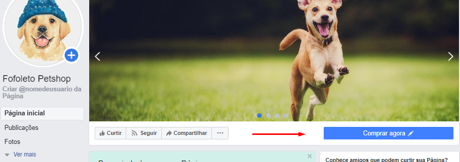
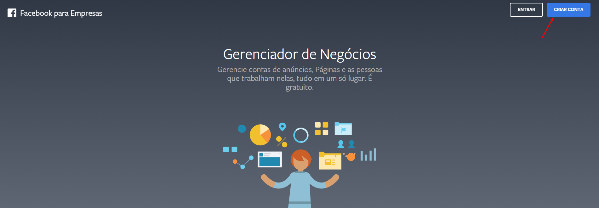

- **Como criar um catálogo de produtos no Facebook:** 

- **Como criar um catálogo de produtos no Facebook:** 

> Existem alguns requisitos para configurar esta opção, são elas:

### 01 - Ter a versão mais atualizada do Instagram.

- **Acesse seu perfil e toque em** 
- **Toque em Configurações** 
- **Toque em SOBRE** 
- **Toque em Atualizações de Aplicativos** 
- **Atualize, se já estiver atualizado mantenha todas as opções ativas para ter atualizações automáticas.** 

### 02 - Mudar a sua conta pessoal para comercial, é necessário ter uma FanPage no Facebook.

- **Acesse seu perfil e toque no menu.** 
- **Toque em Configurações.** 
- **Toque em Conta.** 
- **Toque em Mudar para Conta Comercial.** 
- **Recomendamos conectar a sua conta comercial a uma Página do Facebook associada à sua empresa.** 

### 03 - Vincular Facebook no Instagram e Instagram no Facebook.

- **No Instagram, acesse seu perfil e toque no menu.**
- **Toque em Configurações.**
- **Toque em Conta.**
- **Toque em Contas Vinculadas.** 
- **Toque em Facebook e vincule sua conta.**

- **No Facebook, acesse sua FanPage e clique em Configurações.**
- **Clique em Instagram.**
- **Clique em Conectar a conta.** 

### 04 - Sua FanPage no Facebook deve estar no modelo compras.

- **Acesse sua FanPage e clique em Configurações**
- **Clique em Modelos e Guias**
- **Clique em Editar**
- **Visualize o modelo Compras e clique em ver detalhes.**
- **Clique em Aplicar Modelo.**    

### 05 - O Botão de ação de sua FanPage deve estar "Comprar agora" com o endereço de sua loja

### 06 - Definir uma opção nas tuas categorias na opção "Categoria Google"

- **Acesse seu Painel Administrativo da sua loja.**
- **Clique em produtos**
- **Clique na Aba  categorias**
- **Clique no icone do lapis em uma categoria dos produtos que querer marcar no Instagram (Caso queira todos os produtos, é preciso inserir Categoria Google em todas as categorias).**
- **No final da página, em Canais de Vendas, defina a Categoria Google e clique em salvar**

### 07 - Gerar XML Facebook no painel da sua loja

- **Acesse seu Painel Administrativo em sua loja.**
- **Clique em canais de venda**
- **Procure XML Facebook e clique em configurar**
- **Para gerar o arquivo com todos os produtos, não selecione nada, apenas clique gerar xml**

### 08 - No Gerenciador de Negócios do Facebook, criar um novo catálogo de produtos

- **No Facebook, é preciso ter uma conta Business para ter acesso ao Gerenciador de Negócios.**

- **Clique em Gerenciador de Anúncios, clique em Gerenciador de Catálogos.**
- **Clique em .**
- **Clique em Comércio Eletrônico e em Avançar.**
- **Selecione Carregar Informações de Produto, selecione uma Conta, dê um nome para o seu novo catálogo e clique em Criar.**
- **Após clique em Ver Catálogo.** 
- **Dentro do catálogo criado, clique em Vendas e Adicionar Produtos.** 
- **Clique em Usar carregamento em massa.**
- **Clique em Feed programado e avançar**
- **Insira a URL do XML gerado na plataforma da soluxcreative**
- **Selecione a programação Diariamente às 07:00 PM**
- **Habilite a opção Adicione atualizações automáticas**
- **Em fonte de dados inclua o endereço da sua loja e selecione a Moeda BRL -Real Brasileiro e envie**

[Clique aqui](https://docs.google.com/document/d/1Xj7LBmr-V0G-3QWnlCugAN_d5WhH31E-M6UY428RTOM/edit?ts=5d02805e)   você consegue ver os principais erros ao gerar um catálogo. É normal ter alguns erros, o mais importante é saber do que se trata e corrigir. 

### 09 - Gerenciando Catálogo criado

- **Clique em Diagnóstico**
- **Logo aparece uma opção de Compras no Instagram para criar produtos e conectar perfis comerciais.**

### 10 -  Marcando um produto no Instagram

- **Acesse seu perfil e toque no menu**
- **Toque em Configurações**
- **Toque em Empresa**
- **Toque em Compras**
- **Selecione um Catálogo**

### IMPORTANTE: 

>Após estas etapas, você deve aguardar a análise do Facebook e Instagram para poder marcar os teus produtos. 

#### Ao fazer um novo post, se o serviço estiver ativo, você já poderá marcar os produtos deste catálogo que você gerou ou mesmo editando algum post antigo e marcando produtos.

