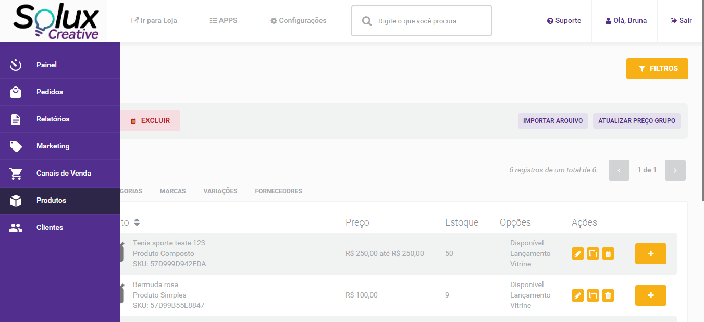
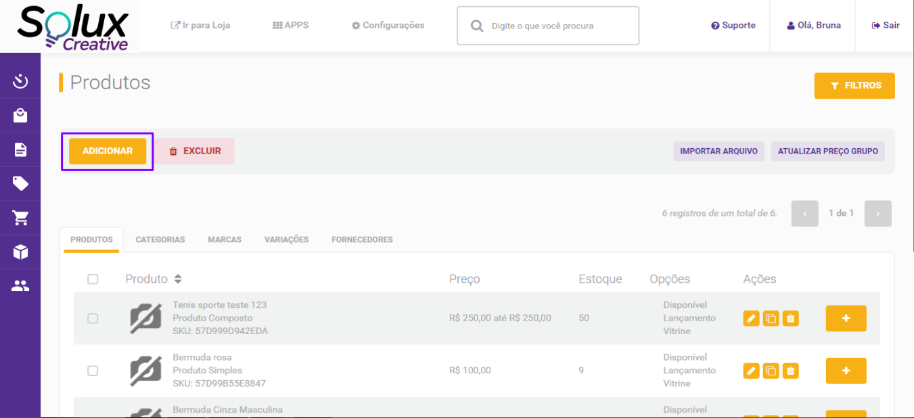
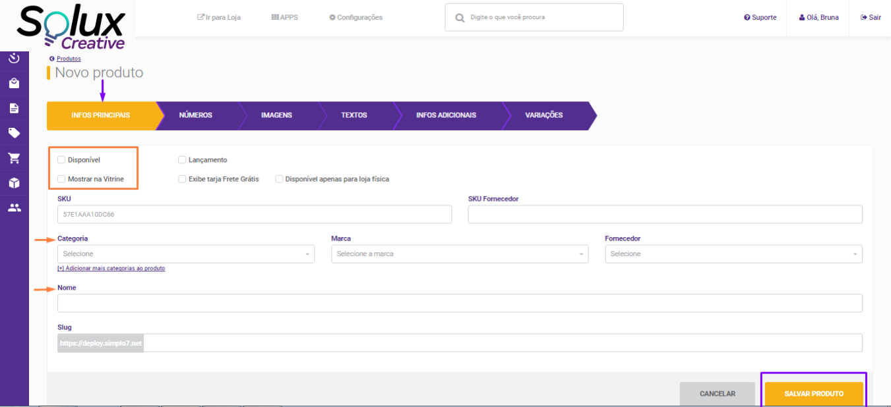
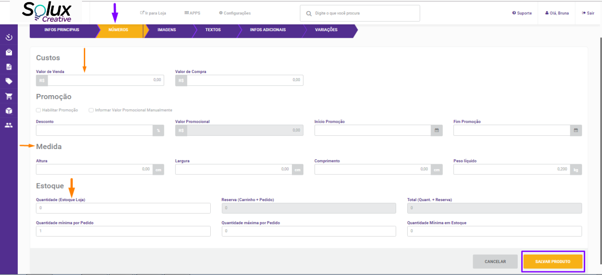
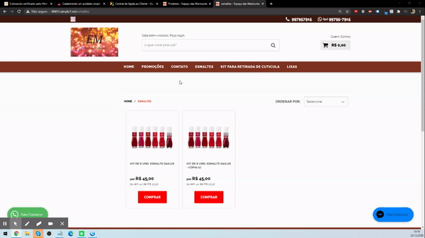
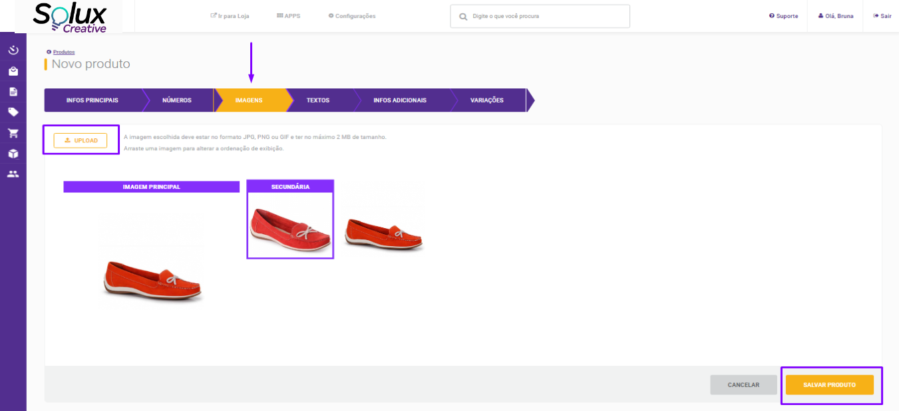
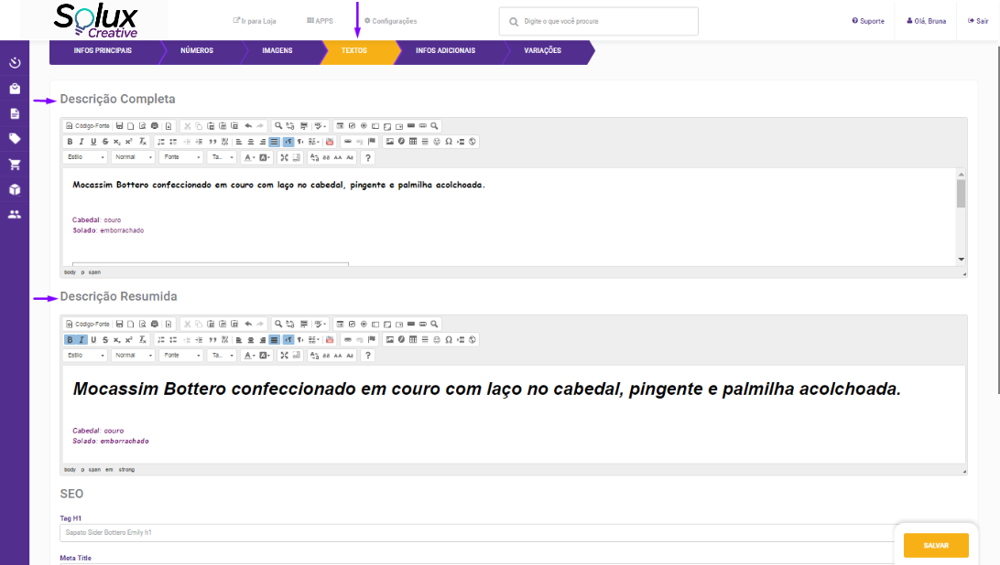
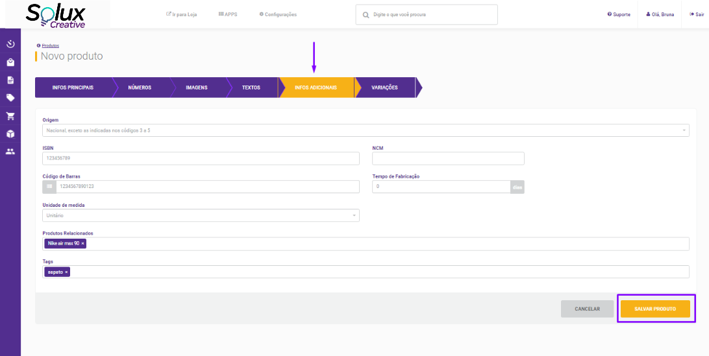
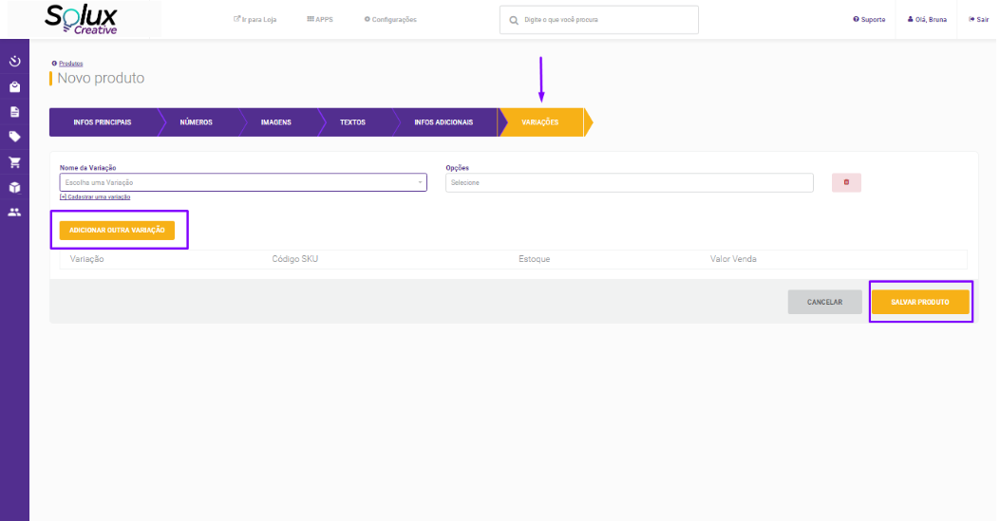
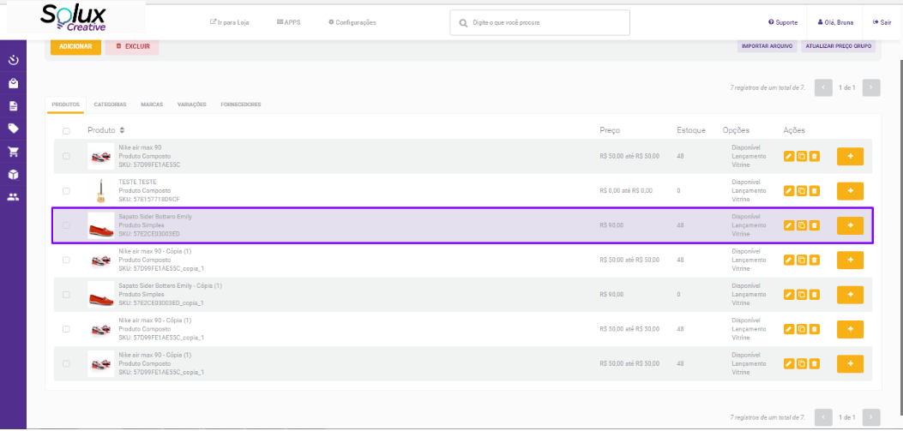

Ao acessar seu painel busque o menu **“Produtos”** que está localizado na
lateral esquerda, conforme a imagem abaixo.

Clique no botão **“Adicionar”** que está destacado em roxo na lateral esquerda,
conforme imagem abaixo:

Na guia **“Infos Principais”**, vamos cadastrar os itens obrigatórios para a
criação de um produto.

Marque **“Disponível e Mostrar na Vitrine”**

**Categoria:** Defina qual a categoria esse produto vai pertencer.

**Nome:** Defina o nome do seu produto

Clique no botão amarelo **“Salvar Produto”** que está no canto inferior direito.

Ao clicar no botão **“Salvar Produto”**, você será direcionado para a guia
seguinte **“Números”**, conforme tela abaixo:

Na guia **“Números”** vamos preencher os seguintes campos obrigatórios para a
criação do produto:

**Valor de Venda:** É o valor que o produto será cobrado.

**Medida:** É necessário preencher a altura, largura, comprimento e peso do
produto, para viabilizar o frete.

**Estoque:** Definir a quantidade de produtos que terá disponível.

Clique no botão amarelo **“Salvar Produto”** que está no canto inferior direito.

Ao clicar no botão **“Salvar Produto”**, você será direcionado para a guia
seguinte **“Imagens”**, conforme tela abaixo:

Vamos agora cadastrar as fotos do seu produto.

Clique no botão **“Upload”** e escolha em seu computador as fotos dos seus
produtos.

Para que você defina uma foto como principal do seu produto, basta apenas
arrastar a imagem, essa imagem principal será a que aparecerá na vitrine/home de
sua loja.

Clicando em qualquer outra imagem você consegue transforma-la em **secundaria**
que é a imagem que aparecerá ao passar o mouse por cima do produto, quando o
produto estiver na vitrine/home, ou quando estiver na página da categoria
correspondente, conforme mostra na imagem abaixo.

Ao clicar no botão **“Salvar Produto”**, você será direcionado para a guia
seguinte **“Textos”**, conforme tela abaixo:

Nessa tela você vai cadastrar a descrição do seu produto. Pode cadastrá-la de
forma completa, ou apenas resumida.

> Obs: Esses campos não são obrigatórios para a criação de seu produto.

Ao clicar no botão **“Salvar Produto”**, você será direcionado para a guia
seguinte **“Infos Adicionais”**, conforme tela abaixo:

Caso seu produto possua código de barras, é nesse campo que você cadastra.

> Obs: Esses campos não são obrigatórios para a criação de seu produto.

Ao clicar no botão **“Salvar Produto”**, você será direcionado para a guia
seguinte **“Variações”**, conforme tela abaixo:

As variações são combinações que estão vinculadas no produto, por exemplo cor,
tamanho, tipo e entre outras, é nessa guia que vamos cadastrar.

**Nome da variação:** Neste local, é onde deve ser inserido o nome do grupo de
variação. A informação deste campo é exibida somente o painel. Ex: **“Cor”**

> Obs: Este item só é obrigatório, caso seu produto possua combinações.

> Obs: Se utilizar integração com ERP(Athos ou Bling), o cadastro das variações
> sera feita pelo ERP.

Clique em **“Salvar produto”**.

Ele aparecerá assim em seu painel:

> Para saber mais sobre edição de produtos com variações utilizando integração
> acesse
> [edição-de-produtos-com-variações](https://blog-soluxcreative.netlify.app/docs/edicao-de-produtos-com-variacoes).
