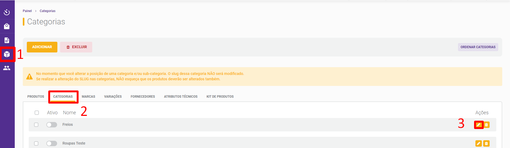
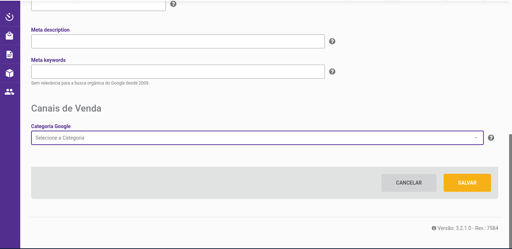
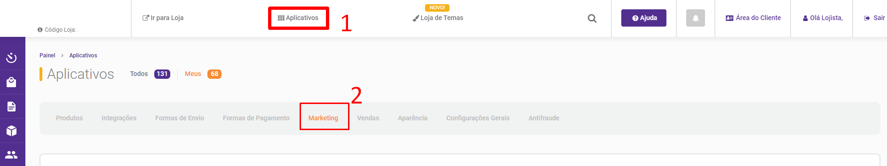
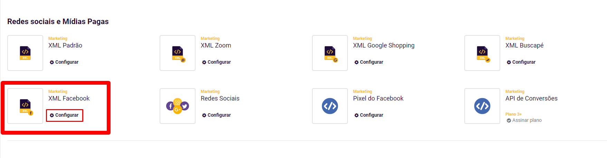
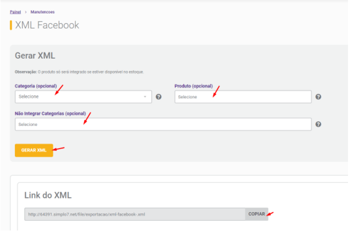
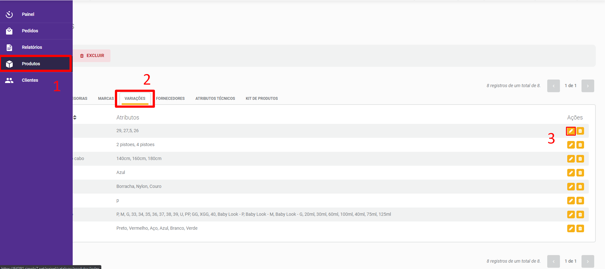
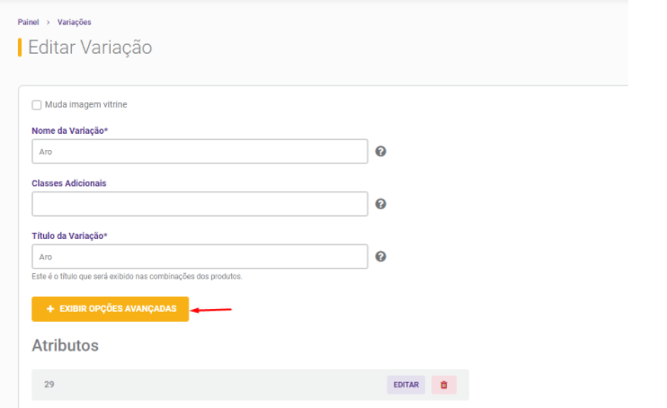
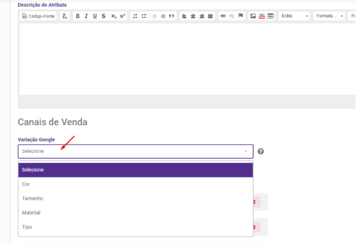

- **O que é:** 

> O XML do Facebook possibilita que o lojista leve os seus produtos para o Gerenciador de catálogo do Facebook. Com isso é possível criar anúncios específicos para cada produto, configurar o Facebook e o Instagram Shopping.

- **Como configurar:** 

### Primeiramente é necessário que os produtos atendam algumas especificações como:

- **Ter um SKU** 
- **Ter uma imagem** 
- **Ter uma Descrição** 
- **Ter uma categoria Google** 
- **Estar Disponível** 
- **Possuir Estoque** 

### 02 - Para adicionar a Categoria google ao XML siga o passo a passo abaixo:

>Produtos > Categorias > Editar conforme imagem 1.
 imagem 1

No final da página selecione a Categoria Google. Neste campo você deverá selecionar a opção que mais se encaixa com o nicho que a categoria que você está configurando representa conforme imagem 2.

 imagem 2

Para gerar o XML basta seguir o caminho: Aplicativos> Marketing > XML Facebook > Configurar conforme imagem 3 e 4.

imagem 3
imagem 4

Para gerar um XML de todos os produtos deixe todos os campos como “Selecione” e em seguida clique em "Gerar XML".

Caso você queira integrar categorias, produto ou excluir uma categoria específica do XML, utilize os filtros conforme a imagem 5.

Para integrar um produto específico somente, é preciso primeiro selecionar a categoria em que ele se encontra.

Após gerar o XML, copie o link clicando em "Copiar" e cole no respectivo campo no Catálogo do Facebook.

### 04 - Sua FanPage no Facebook deve estar no modelo compras.

#### Este link sempre será como a estrutura abaixo:
**seudomínio.com.br/file/exportacao/xml-facebook-.xml**

imagem 5

Caso você queira adicionar as variações **Google no XML**, como por exemplo <g:size> ou <g:color>  siga o passo a passo abaixo:

> Produtos > Variações > Editar conforme imagem 6.
imagem 6

> Exibir Opções Avançadas conforme imagem 7.
imagem 7

> Abaixo da descrição do Atributo selecione a **Variação Google** conforme imagem 8.
imagem 8

#### Veja também a documentação de auxílio na configuração do Catálogo do Facebook e Instagram Shopping aonde você irá utilizar o XML do Facebook:

[Catálogo Facebook e Instagram Shopping](https://blog-soluxcreative.netlify.app/docs/2021-04-30-instagram-facebook-shopping/).

